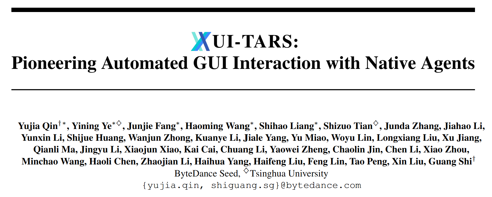
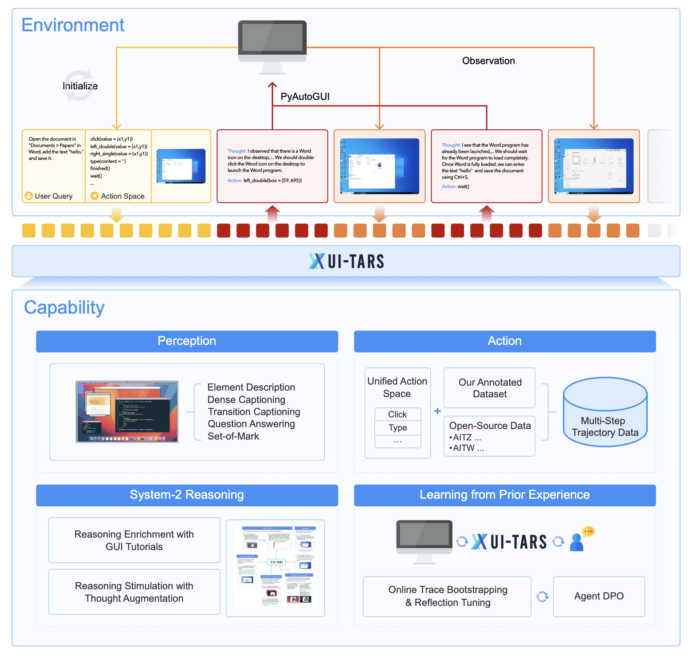

<!-- <p align="center">
  
</p>

# UI-TARS: Pioneering Automated GUI Interaction with Native Agents -->

<p align="center">
        🌐 <a href="https://seed-tars.com/">Website</a>&nbsp&nbsp | 🤗 <a href="https://huggingface.co/ByteDance-Seed/UI-TARS-1.5-7B">Hugging Face Models</a>&nbsp&nbsp 
        | &nbsp&nbsp 🔧 <a href="README_deploy.md">Deployment</a> &nbsp&nbsp  | &nbsp&nbsp 📑 <a href="https://arxiv.org/abs/2501.12326">Paper</a> &nbsp&nbsp  |&nbsp&nbsp</a>
🖥️ <a href="https://github.com/bytedance/UI-TARS-desktop">UI-TARS-desktop</a>&nbsp&nbsp  <br>🏄 <a href="https://github.com/web-infra-dev/Midscene">Midscene (Browser Automation) </a>&nbsp&nbsp | &nbsp&nbsp🫨 <a href="https://discord.gg/pTXwYVjfcs">Discord</a>&nbsp&nbsp
</p>

We also offer a **UI-TARS-desktop** version, which can operate on your **local personal device**. To use it, please visit [https://github.com/bytedance/UI-TARS-desktop](https://github.com/bytedance/UI-TARS-desktop). To use UI-TARS in web automation, you may refer to the open-source project [Midscene.js](https://github.com/web-infra-dev/Midscene).

## Updates
- 🌟 2025.04.16: We shared the latest progress of the UI-TARS-1.5 model in our [blog](https://seed-tars.com/1.5), which excels in playing games and performing GUI tasks, and we open-sourced the [UI-TARS-1.5-7B](https://huggingface.co/ByteDance-Seed/UI-TARS-1.5-7B).
- ✨ 2025.03.23: We updated the OSWorld inference scripts from the original official [OSWorld repository](https://github.com/xlang-ai/OSWorld/blob/main/run_uitars.py). Now, you can use the OSWorld official inference scripts to reproduce our results.

## Introduction

UI-TARS-1.5, an open-source multimodal agent built upon a powerful vision-language model. It is capable of effectively performing diverse tasks within virtual worlds.

Leveraging the foundational architecture introduced in [our recent paper](https://arxiv.org/abs/2501.12326), UI-TARS-1.5 integrates advanced reasoning enabled by reinforcement learning. This allows the model to reason through its thoughts before taking action, significantly enhancing its performance and adaptability, particularly in inference-time scaling. Our new 1.5 version achieves state-of-the-art results across a variety of standard benchmarks, demonstrating strong reasoning capabilities and notable improvements over prior models.
<!--  -->
<p align="center">
    <video controls width="480">
      <source src="https://huggingface.co/datasets/JjjFangg/Demo_video/resolve/main/GUI_demo.mp4" type="video/mp4">
    </video>

<p>
<p align="center">
    <video controls width="480">
      <source src="https://huggingface.co/datasets/JjjFangg/Demo_video/resolve/main/Game_demo.mp4" type="video/mp4">
    </video>
<p>

## 🚀 Quick Start Guide: Deploying and Using Our Model

To help you get started quickly with our model, we recommend following the steps below in order. These steps will guide you through deployment, prediction post-processing, and evaluation using the OSWorld benchmark.


### ✅ Step 1: Deployment & Inference

👉 <a href="README_deploy.md">Deployment and Inference</a>.
This includes instructions for model deployment using huggingface endpoint, and running your first prediction.


### ✅ Step 2: Post Processing

👉 <a href="codes/action_parser.py">Prediction Post-Processing</a>.
This includes parsing model predictions to executable pyautogui codes.
To help you better understand the coordinate processing, we also provide a <a href="README_coordinates.md">guide</a> for coordinates processing visualization.

## Prompt Usage Guide

To accommodate different device environments and task complexities, the following three prompt templates in <a href="codes/prompts.py">codes/prompts.py</a>. are designed to guide GUI agents in generating appropriate actions. Choose the template that best fits your use case:

### 🖥️ `COMPUTER_USE`

**Recommended for**: GUI tasks on **desktop environments** such as Windows, Linux, or macOS.

**Features**:
- Supports common desktop operations: mouse clicks (single, double, right), drag actions, keyboard shortcuts, text input, scrolling, etc.
- Ideal for browser navigation, office software interaction, file management, and other desktop-based tasks.


### 📱 `MOBILE_USE`

**Recommended for**: GUI tasks on **mobile devices or Android emulators**.

**Features**:
- Includes mobile-specific actions: `long_press`, `open_app`, `press_home`, `press_back`.
- Suitable for launching apps, scrolling views, filling input fields, and navigating within mobile apps.


### 📌 `GROUNDING`

**Recommended for**: Lightweight tasks focused solely on **action output**, or for use in model training and evaluation.

**Features**:
- Only outputs the `Action` without any reasoning (`Thought`).
- Useful for evaluating grounding capability.

---

When developing or evaluating multimodal interaction systems, choose the appropriate prompt template based on your target platform (desktop vs. mobile) 


## Performance
**Online Benchmark Evaluation**
| Benchmark type | Benchmark                                                                                                                                       | UI-TARS-1.5 | OpenAI CUA | Claude 3.7 | Previous SOTA       |
|----------------|--------------------------------------------------------------------------------------------------------------------------------------------------|-------------|-------------|-------------|----------------------|
| **Computer Use** | [OSworld](https://arxiv.org/abs/2404.07972) (100 steps)                                                                                        | **42.5**     | 36.4        | 28          | 38.1 (200 step)      |
|                | [Windows Agent Arena](https://arxiv.org/abs/2409.08264) (50 steps)                                                                              | **42.1**     | -           | -           | 29.8                 |
| **Browser Use**  | [WebVoyager](https://arxiv.org/abs/2401.13919)                                                                                                 | 84.8         | **87**      | 84.1        | 87                   |
|                | [Online-Mind2web](https://arxiv.org/abs/2504.01382)                                                                                              | **75.8**     | 71          | 62.9        | 71                   |
| **Phone Use**    | [Android World](https://arxiv.org/abs/2405.14573)                                                                                              | **64.2**     | -           | -           | 59.5                 |


**Grounding Capability Evaluation**
| Benchmark | UI-TARS-1.5 | OpenAI CUA | Claude 3.7 | Previous SOTA |
|-----------|-------------|------------|------------|----------------|
| [ScreenSpot-V2](https://arxiv.org/pdf/2410.23218) | **94.2** | 87.9 | 87.6 | 91.6 |
| [ScreenSpotPro](https://arxiv.org/pdf/2504.07981v1) | **61.6** | 23.4 | 27.7 | 43.6 |


**Poki Game**

| Model       | [2048](https://poki.com/en/g/2048) | [cubinko](https://poki.com/en/g/cubinko) | [energy](https://poki.com/en/g/energy) | [free-the-key](https://poki.com/en/g/free-the-key) | [Gem-11](https://poki.com/en/g/gem-11) | [hex-frvr](https://poki.com/en/g/hex-frvr) | [Infinity-Loop](https://poki.com/en/g/infinity-loop) | [Maze:Path-of-Light](https://poki.com/en/g/maze-path-of-light) | [shapes](https://poki.com/en/g/shapes) | [snake-solver](https://poki.com/en/g/snake-solver) | [wood-blocks-3d](https://poki.com/en/g/wood-blocks-3d) | [yarn-untangle](https://poki.com/en/g/yarn-untangle) | [laser-maze-puzzle](https://poki.com/en/g/laser-maze-puzzle) | [tiles-master](https://poki.com/en/g/tiles-master) |
|-------------|-----------|--------------|-------------|-------------------|-------------|---------------|---------------------|--------------------------|-------------|--------------------|----------------------|---------------------|------------------------|---------------------|
| OpenAI CUA  | 31.04     | 0.00         | 32.80       | 0.00              | 46.27       | 92.25         | 23.08               | 35.00                    | 52.18       | 42.86              | 2.02                 | 44.56               | 80.00                  | 78.27               |
| Claude 3.7  | 43.05     | 0.00         | 41.60       | 0.00              | 0.00        | 30.76         | 2.31                | 82.00                    | 6.26        | 42.86              | 0.00                 | 13.77               | 28.00                  | 52.18               |
| UI-TARS-1.5 | 100.00    | 0.00         | 100.00      | 100.00            | 100.00      | 100.00        | 100.00              | 100.00                   | 100.00      | 100.00             | 100.00               | 100.00              | 100.00                 | 100.00              |


**Minecraft**

| Task Type   | Task Name           | [VPT](https://openai.com/index/vpt/) | [DreamerV3](https://www.nature.com/articles/s41586-025-08744-2) | Previous SOTA | UI-TARS-1.5 w/o Thought | UI-TARS-1.5 w/ Thought |
|-------------|---------------------|----------|----------------|--------------------|------------------|-----------------|
| Mine Blocks | (oak_log)               | 0.8      | 1.0            | 1.0                | 1.0              | 1.0             |
|             | (obsidian)          | 0.0      | 0.0            | 0.0                | 0.2              | 0.3             |
|             | (white_bed)               | 0.0      | 0.0            | 0.1                | 0.4              | 0.6             |
|             | **200 Tasks Avg.**  | 0.06     | 0.03           | 0.32               | 0.35             | 0.42            |
| Kill Mobs   | (mooshroom)            | 0.0      | 0.0            | 0.1                | 0.3              | 0.4             |
|             | (zombie)            | 0.4      | 0.1            | 0.6                | 0.7              | 0.9             |
|             | (chicken)          | 0.1      | 0.0            | 0.4                | 0.5              | 0.6             |
|             | **100 Tasks Avg.**  | 0.04     | 0.03           | 0.18               | 0.25             | 0.31            |

## Model Scale Comparison

Here we compare performance across different model scales of UI-TARS on the OSworld benchmark.

| **Benchmark Type** | **Benchmark**                      | **UI-TARS-72B-DPO** | **UI-TARS-1.5-7B** | **UI-TARS-1.5** |
|--------------------|------------------------------------|---------------------|--------------------|-----------------|
| Computer Use       | [OSWorld](https://arxiv.org/abs/2404.07972)             | 24.6                | 27.5               | **42.5**        |
| GUI Grounding      | [ScreenSpotPro](https://arxiv.org/pdf/2504.07981v1) | 38.1                | 49.6               | **61.6**        |

### Limitations

While UI-TARS-1.5 represents a significant advancement in multimodal agent capabilities, we acknowledge several important limitations:

- **Misuse:** Given its enhanced performance in GUI tasks, including successfully navigating authentication challenges like CAPTCHA, UI-TARS-1.5 could potentially be misused for unauthorized access or automation of protected content. To mitigate this risk, extensive internal safety evaluations are underway.
- **Computation:** UI-TARS-1.5 still requires substantial computational resources, particularly for large-scale tasks or extended gameplay scenarios.
- **Hallucination**: UI-TARS-1.5 may occasionally generate inaccurate descriptions, misidentify GUI elements, or take suboptimal actions based on incorrect inferences—especially in ambiguous or unfamiliar environments.
- **Model scale:** The released UI-TARS-1.5-7B focuses primarily on enhancing general computer use capabilities and is not specifically optimized for game-based scenarios, where the UI-TARS-1.5 still holds a significant advantage.

## What's next

We are providing early research access to our top-performing UI-TARS-1.5 model to facilitate collaborative research. Interested researchers can contact us at TARS@bytedance.com.

Looking ahead, we envision UI-TARS evolving into increasingly sophisticated agentic experiences capable of performing real-world actions, thereby empowering platforms such as [doubao](https://team.doubao.com/en/) to accomplish more complex tasks for you :)

## Star History

[](https://www.star-history.com/#bytedance/UI-TARS&Date)

## Citation
If you find our paper and model useful in your research, feel free to give us a cite.

```BibTeX
@article{qin2025ui,
  title={UI-TARS: Pioneering Automated GUI Interaction with Native Agents},
  author={Qin, Yujia and Ye, Yining and Fang, Junjie and Wang, Haoming and Liang, Shihao and Tian, Shizuo and Zhang, Junda and Li, Jiahao and Li, Yunxin and Huang, Shijue and others},
  journal={arXiv preprint arXiv:2501.12326},
  year={2025}
}
```